# PMG Quarantine Admin

English | [Türkçe](README.tr.md)

**Version:** 0.5.0 · [Changelog](CHANGELOG.md)

A mobile-first, fully responsive admin console for [Proxmox Mail
Gateway](https://www.proxmox.com/en/proxmox-mail-gateway) (PMG). It gives
mail/security admins a fast, dense interface for two things PMG's own web
UI doesn't do well on mobile: reviewing and acting on quarantined mail,
and looking up mail delivery status in the Tracking Center.

Runs as a single, separate Docker container - it never touches the PMG
appliance itself, only talks to it over the PMG API.

## Features

- **Dashboard** - the landing page after login: a 7-day overview with
  quarantine volume, message delivery status, and top senders/receivers,
  plus best-effort cross-linking between a Quarantine message and its
  matching Tracking Center entry (and back).
- **Quarantine management** - list, search/filter, and act on quarantined
  mail (deliver, whitelist, block, delete), with a swipeable card list on
  mobile and a dense data table on desktop.
- **Tracking Center** - look up a message's delivery status and syslog
  trail by sender, recipient, or filter, read-only.
- **Saved filter presets and CSV export** on both the Quarantine and
  Tracking Center list pages.
- **Per-admin PMG login** - every admin authenticates with their own PMG
  account (Help Desk role), so PMG's own audit log correctly attributes
  actions to the individual admin instead of a shared service account. No
  PMG credentials are ever stored - only the short-lived ticket/CSRF
  token PMG issues, kept server-side in an httpOnly session cookie.
- **Dark/light theme**, installable as a PWA.

Out of scope: welcomelist/blocklist *policy* management (global or
per-domain) - use PMG's own UI for that.

## Screenshots

### Desktop

<table>
<tr>
<td width="50%">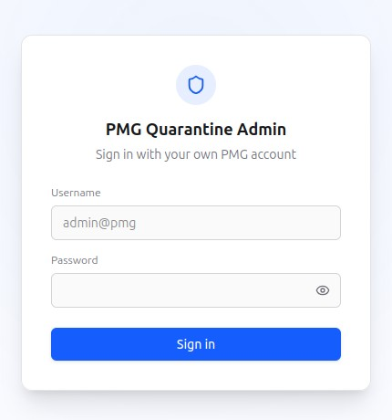<br/><sub>Login</sub></td>
<td width="50%">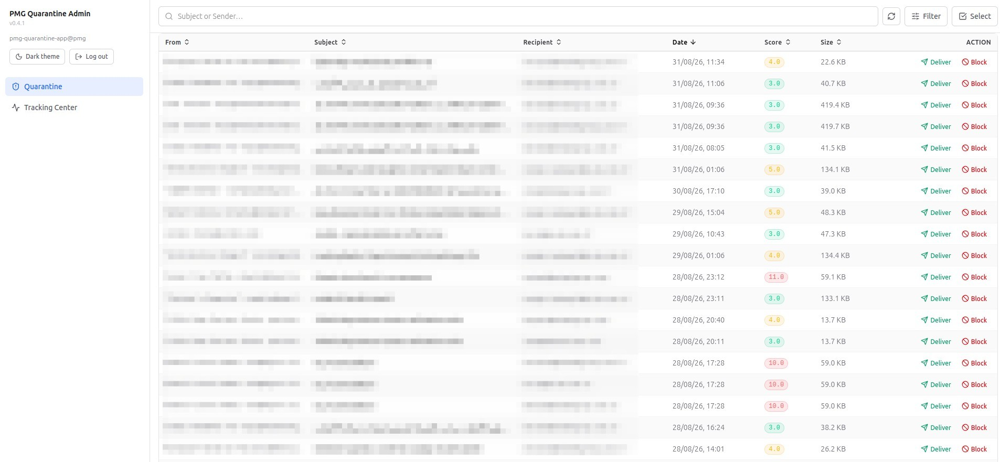<br/><sub>Quarantine - list view</sub></td>
</tr>
<tr>
<td width="50%">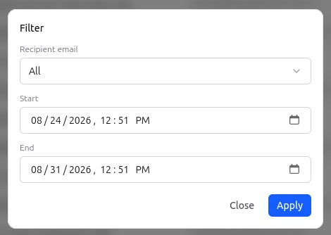<br/><sub>Quarantine - filter</sub></td>
<td width="50%">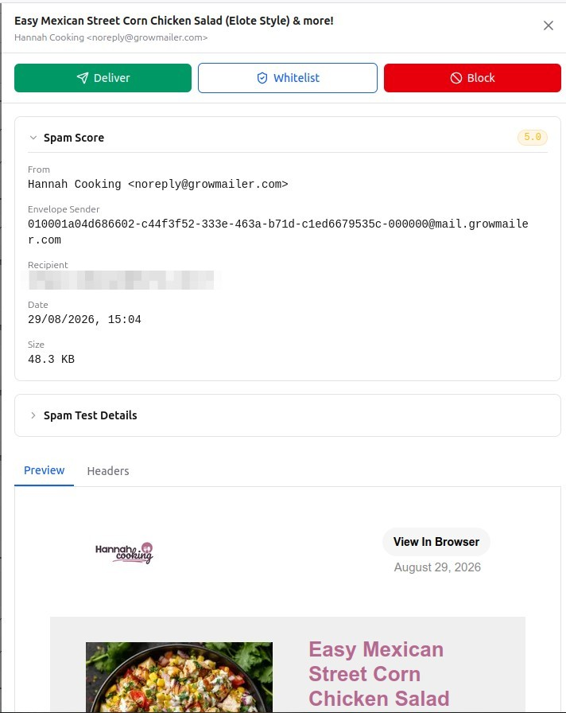<br/><sub>Quarantine - message detail</sub></td>
</tr>
<tr>
<td width="50%">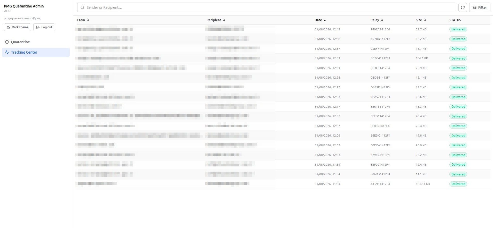<br/><sub>Tracking Center - list view</sub></td>
<td width="50%">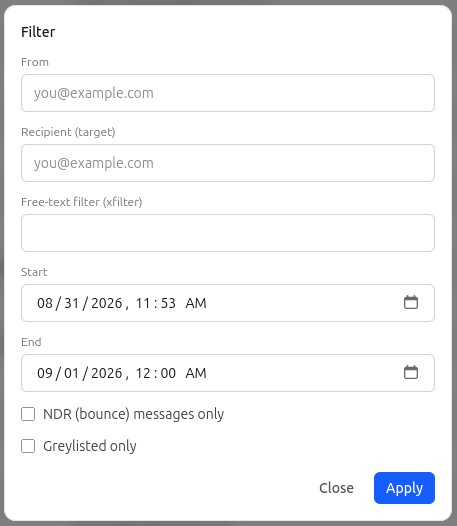<br/><sub>Tracking Center - filter</sub></td>
</tr>
<tr>
<td width="50%">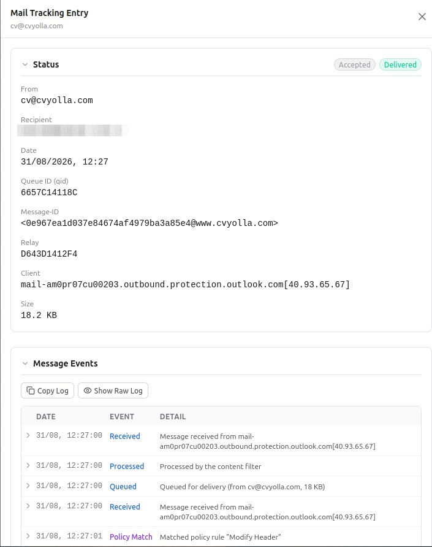<br/><sub>Tracking Center - message detail</sub></td>
<td width="50%">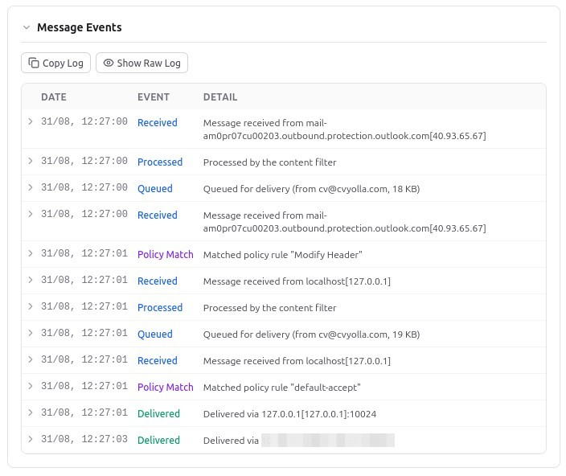<br/><sub>Tracking Center - structured Message Events</sub></td>
</tr>
</table>

### Mobile

<table>
<tr>
<td width="33%">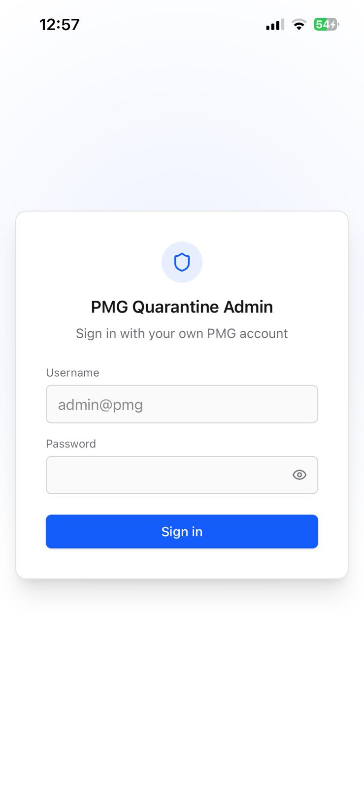<br/><sub>Login</sub></td>
<td width="33%">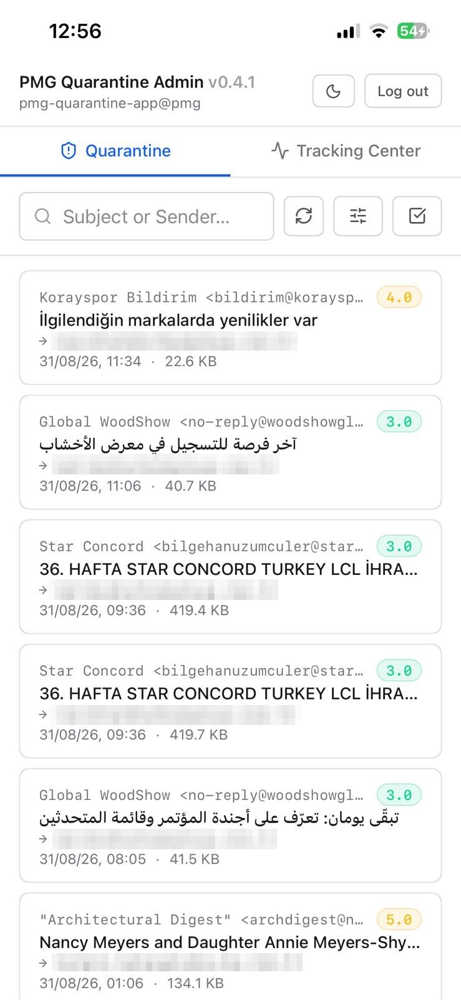<br/><sub>Quarantine - list view</sub></td>
<td width="33%">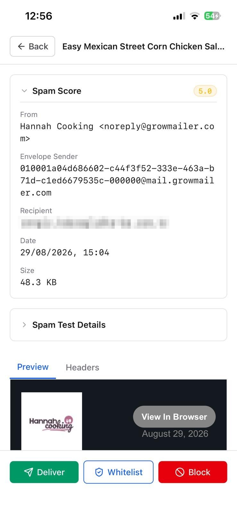<br/><sub>Quarantine - message detail</sub></td>
</tr>
<tr>
<td width="33%">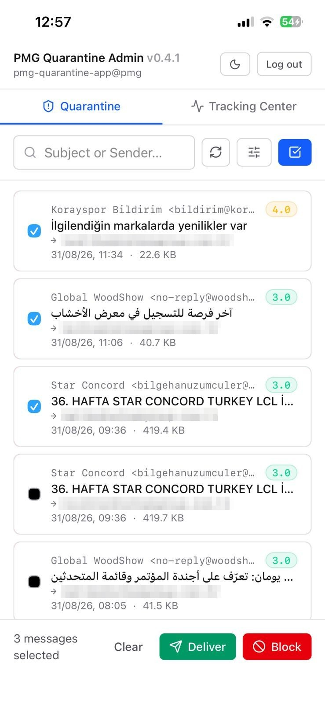<br/><sub>Quarantine - multi-select</sub></td>
<td width="33%">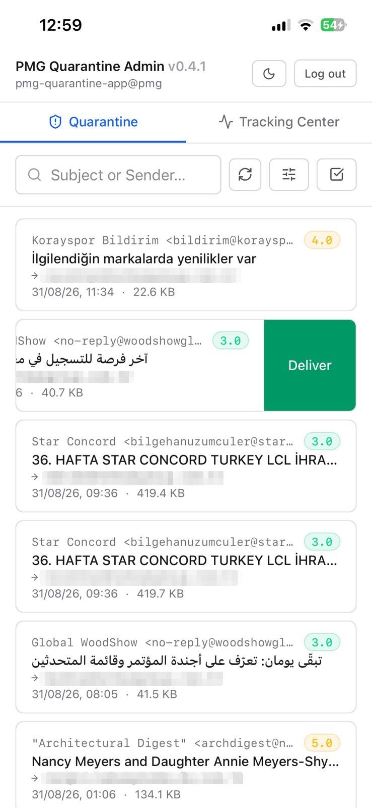<br/><sub>Quarantine - swipe to deliver</sub></td>
<td width="33%">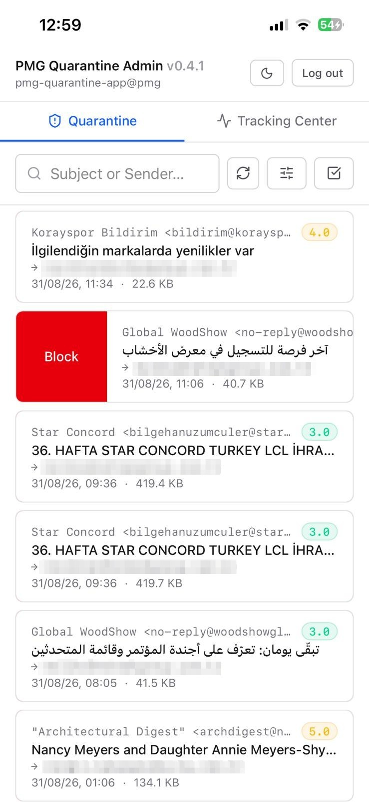<br/><sub>Quarantine - swipe to block</sub></td>
</tr>
<tr>
<td width="33%">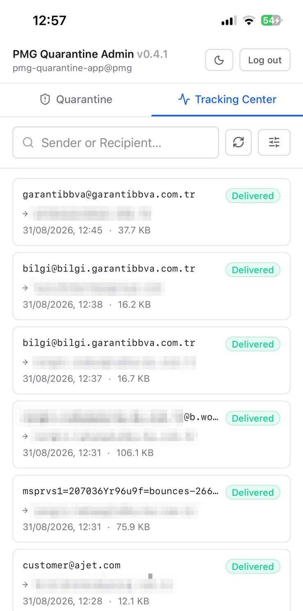<br/><sub>Tracking Center - list view</sub></td>
<td width="33%">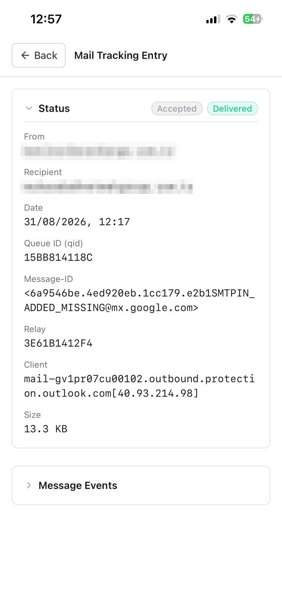<br/><sub>Tracking Center - message detail</sub></td>
<td width="33%">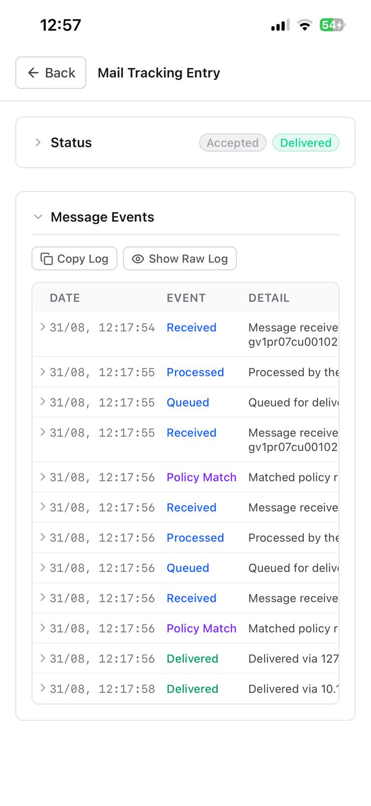<br/><sub>Tracking Center - structured Message Events</sub></td>
</tr>
</table>

## Tech Stack

- **Backend:** Node.js/Express, acting as an auth + PMG API proxy
  (browser never talks to PMG directly - no CORS on the PMG API, and
  PMG's ticket/CSRF flow needs to stay server-side).
- **Frontend:** React + Tailwind CSS, mobile-first.
- **Packaging:** a single multi-stage Dockerfile - one Express process
  serves both the `/api/*` routes and the built frontend as static files.

## Prerequisites

- Docker and Docker Compose
- A PMG server reachable from wherever this container runs, and one PMG
  account per admin with the **Help Desk** role (Quarantine Manager alone
  can't access Tracking Center; Administrator/root@pam is unnecessary and
  not recommended)

## Setup

```bash
git clone https://github.com/ikrsdo/pmg-quarantine-admin.git
cd pmg-quarantine-admin
cp .env.example .env
```

Edit `.env` and set at least `PMG_BASE_URL` and `SESSION_SECRET` (see
[Configuration](#configuration) below). Then:

```bash
docker compose up -d --build
```

The app listens on port 3000 (`http://localhost:3000` for a quick local
check). Sign in with your own PMG username/password on the login screen.

## Updating

To update to the latest version, run this from inside the project
directory (the one containing `docker-compose.yml`) to pull the new
code and rebuild the image:

```bash
cd pmg-quarantine-admin
sudo git pull && sudo docker compose up -d --build
```

## Configuration

All configuration is via environment variables - see `.env.example` for
the full template.

| Variable | Description |
|---|---|
| `PMG_BASE_URL` | Base URL of your PMG server, e.g. `https://pmg.example.local:8006` |
| `PMG_API_PATH` | PMG API path, normally `/api2/json` |
| `PMG_ALLOW_SELF_SIGNED` | `true` to accept PMG's self-signed certificate (typical for internal networks) |
| `NODE_ENV` | `production` in deployment - also controls whether the session cookie requires HTTPS |
| `PORT` | Port the backend listens on (default `3000`) |
| `SESSION_SECRET` | Long random string used to sign session cookies - always set your own |

No PMG username/password ever goes in `.env` - each admin enters their
own credentials on the login screen at request time.

## Exposing it outside your local network

This project's `docker-compose.yml` only runs the `app` service - no
reverse proxy or tunnel is bundled. Put it behind whatever you already
use to expose internal services over HTTPS (Cloudflare Tunnel, nginx,
Traefik, Caddy, etc.), pointing at the container's published port.

The session cookie is marked `Secure` whenever `NODE_ENV=production`,
so the app must be accessed over HTTPS in that mode - a plain-HTTP
reverse proxy hop, or testing directly over `http://`, will cause the
login to silently fail to persist.

Adding an authentication layer (e.g. Cloudflare Access) in front of the
app, as a second factor before the PMG login screen, is recommended for
anything reachable from outside a trusted network.

## Security Notes

**Credentials and sessions**

- No PMG username/password ever touches `.env`, disk, or the browser -
  each admin's password is forwarded to PMG once at login time and
  never stored anywhere; only the short-lived ticket/CSRF token PMG
  issues is kept, server-side, tied to that admin's own httpOnly,
  `Secure` (in production), `SameSite=lax` session cookie. The session
  is regenerated on every successful login to prevent session fixation.
- Use a dedicated PMG account per admin (Help Desk role), never
  `root@pam` - see [Prerequisites](#prerequisites).
- `.env` is never committed - it holds no PMG credentials, only
  connection/session settings.

**Backend hardening**

- `/api/login` is rate-limited (20 attempts per 15 minutes per IP) to
  slow down PMG credential brute-forcing, the one endpoint reachable
  without an existing session.
- Every quarantine action is checked against a fixed whitelist of valid
  PMG actions (`deliver`, `delete`, `whitelist`, `blocklist`, etc.)
  before it's forwarded to PMG - arbitrary action strings are rejected.
- Security headers (via [Helmet](https://helmetjs.github.io/)) are set
  on every response: `X-Frame-Options`, `X-Content-Type-Options`,
  `Referrer-Policy`, and removal of the `X-Powered-By` header, among
  others.
- The quarantined-mail HTML preview is rendered through PMG's own
  sanitizing formatter and loaded into a `sandbox=""` iframe on the
  frontend; the backend route that serves it also sends its own
  `Content-Security-Policy: sandbox` header as defense-in-depth against
  direct navigation to that URL.
- The Docker image runs as a non-root user, not root.
- Dependencies are checked with `npm audit` before each release (0
  known vulnerabilities as of this version).

**Network**

- Restrict network access to the PMG API to this container's network/VPN
  - don't expose the PMG API itself to the general internet.
- Treat `PMG_ALLOW_SELF_SIGNED=true` as a deliberate, documented choice
  for internal/lab networks, not a default to leave on blindly - a
  warning is logged on startup whenever it's enabled.
- See [Exposing it outside your local network](#exposing-it-outside-your-local-network)
  for HTTPS and reverse-proxy requirements.
- The one exception to "no outbound calls besides PMG": the browser
  calls the public, unauthenticated GitHub API
  (`api.github.com/repos/.../tags`) on load to check for a newer
  release and show an update banner. No credentials or app data are
  sent - only a plain `GET` request. Fails silently if GitHub is
  unreachable (e.g. an air-gapped deployment).

If you find a security issue, please open an issue (or contact the
maintainer directly for anything sensitive) rather than a public PR.

## Development

See `CLAUDE.md` for the full set of architecture decisions and PMG API
notes this project was built against, and `app/backend/README.md` for
backend-specific dev/test commands.
